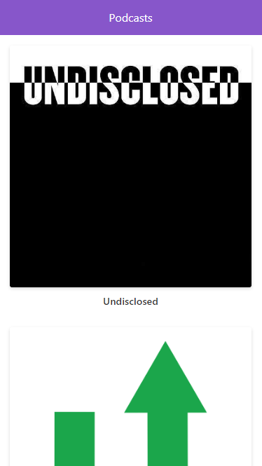

# App de Podcasts de Platzi

App de Podcasts integrada con la API de AudioBoom para aprender Next.js

## ¿Comó funciona?

Requiere Node.js 

* `npm install` para instalar las dependencias.
* `npm run dev` para el entorno de desarollo.
* `npm run build && npm start` para el entorno de producción.